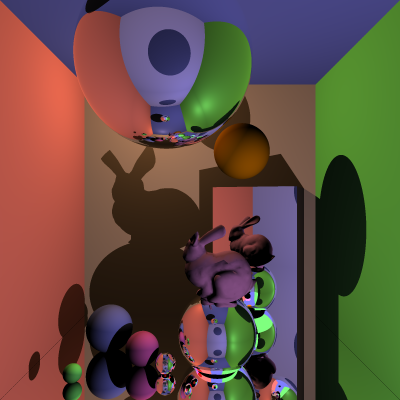

# Ray Tracer

“Everyone should write a ray tracer at least once” - Matt Booty, Head of Xbox Game Studios @ Microsoft


## Completed stages

##### Stage 1

- [x] Stage 1.1 - Familiarise yourself with the template
- [x] Stage 1.2 - Implement vector mathematics
- [x] Stage 1.3 - Fire a ray for each pixel
- [x] Stage 1.4 - Calculate ray-entity intersections
- [x] Stage 1.5 - Output primitives as solid colours

##### Stage 2

- [x] Stage 2.1 - Diffuse materials
- [x] Stage 2.2 - Shadow rays 
- [x] Ste 2.3 - Reflective materials
- [x] Stage 2.4 - Refractive materials
- [x] Stage 2.5 - The Fresnel effect
- [x] Stage 2.6 - Anti-aliasing

##### Stage 3

- [ ] Option A - Emissive materials
- [ ] Option B - Ambient lighting/occlusion
- [x] Option C - OBJ models
- [ ] Option D - Glossy materials
- [ ] Option E - Custom camera orientation
- [x] Option F - Beer's law
- [ ] Option G - Depth of field

## Final scene render



It took 11 minutes and 46 seconds to render on my PC.

Command to render the image exactly as shown:

```
dotnet run -- -f tnet run -- -f tests/final_scene.txt -o images/final_scene.png -x 4
```

## References
[Sctrachpixel](https://www.scratchapixel.com/)

